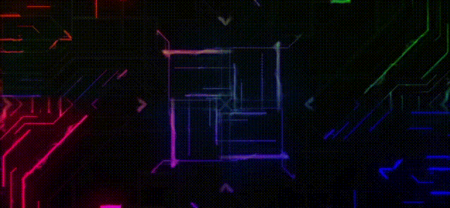

 

---

### Hi there, Welcome to my GitHub 👋

My name is Vasileios Bomponis, and i am a Full Stack Developer 🚀 based in Amsterdam! I love creating Applications and Websites. I love when I'm getting triggered by something, implementing my knowledge and trying to create something unique.

Hereby my [Portfolio ®](https://vasileiosbomponis.netlify.app/)

- 🌱 Learning anything I can get my hands on!
- 👯 Always looking to collaborate
- 💬 Ask me about anything !
- 📫 How to reach me: vasileios.bobonis@gmail.com
- ⚡ Let's connect – [LinkedIn](https://www.linkedin.com/in/vasileios-bomponis-a20673121/)

---

### Languages & Tools

---

### My GitHub Stats

